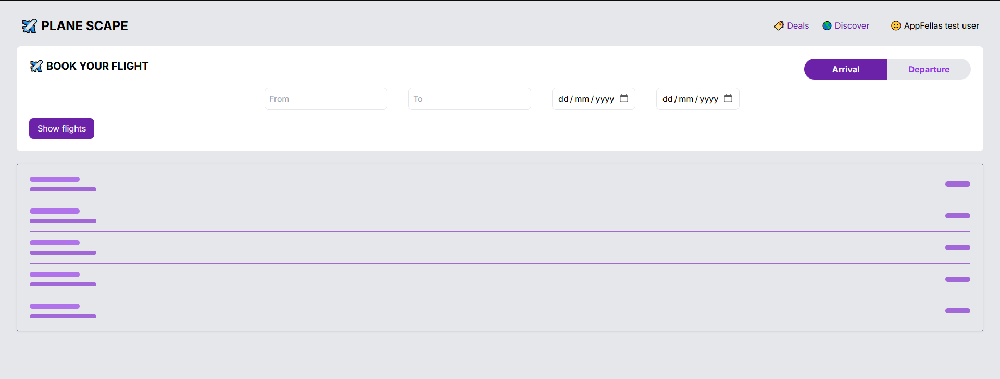
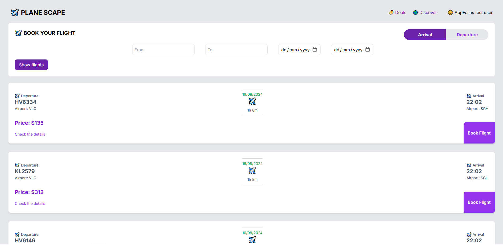
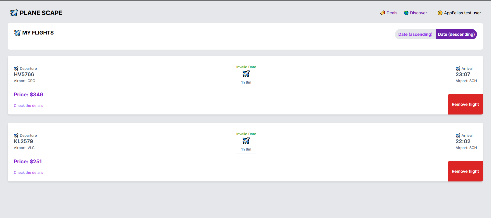

[Live demo](https://appfellas-case.vercel.app)

## Screenshots







This is a [Next.js](https://nextjs.org/) project bootstrapped with [`create-next-app`](https://github.com/vercel/next.js/tree/canary/packages/create-next-app).

### TODOs
* Implement flight detail page using /flights/{id} endpoint of Schiphol PublicFlight API
* Add advanced filter options on both screens such as airline selection, direct or connecting flights, one way - roundtrip selection [in progress]
* Add data validation
* Add user feedback UI (alerts, dialogs etc.)
* Improve UX by easing the filtering processes
* Add responsiveness
* Cover external API error messages
* Disable unavailable dates on date picker

## Getting Started

First, run the development server:

```bash
npm run dev
# or
yarn dev
# or
pnpm dev
# or
bun dev
```

Open [http://localhost:3000](http://localhost:3000) with your browser to see the result.

You can start editing the page by modifying `app/page.js`. The page auto-updates as you edit the file.

This project uses [`next/font`](https://nextjs.org/docs/basic-features/font-optimization) to automatically optimize and load Inter, a custom Google Font.

## Deploy on Vercel

The easiest way to deploy your Next.js app is to use the [Vercel Platform](https://vercel.com/new?utm_medium=default-template&filter=next.js&utm_source=create-next-app&utm_campaign=create-next-app-readme) from the creators of Next.js.

Check out our [Next.js deployment documentation](https://nextjs.org/docs/deployment) for more details.
